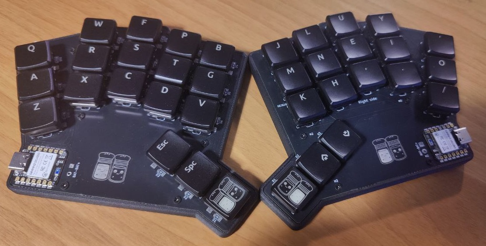
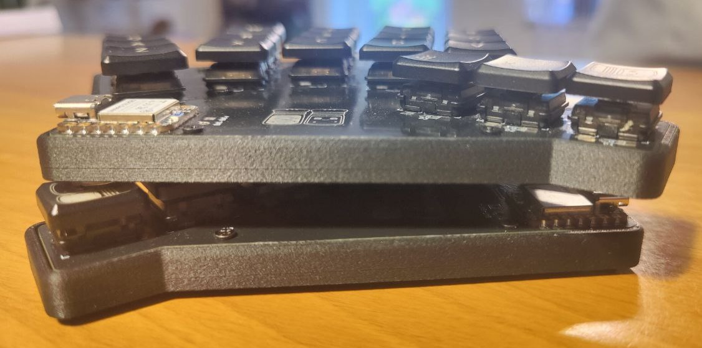
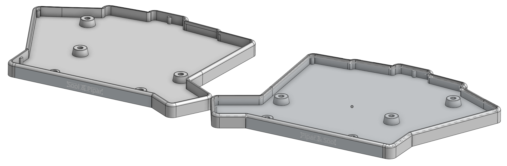
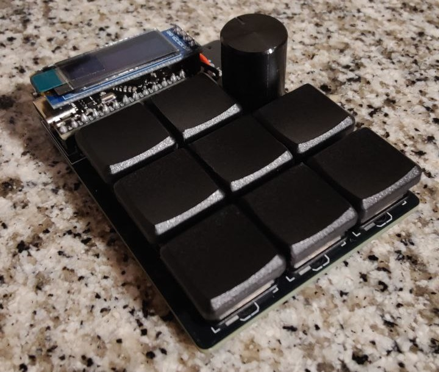
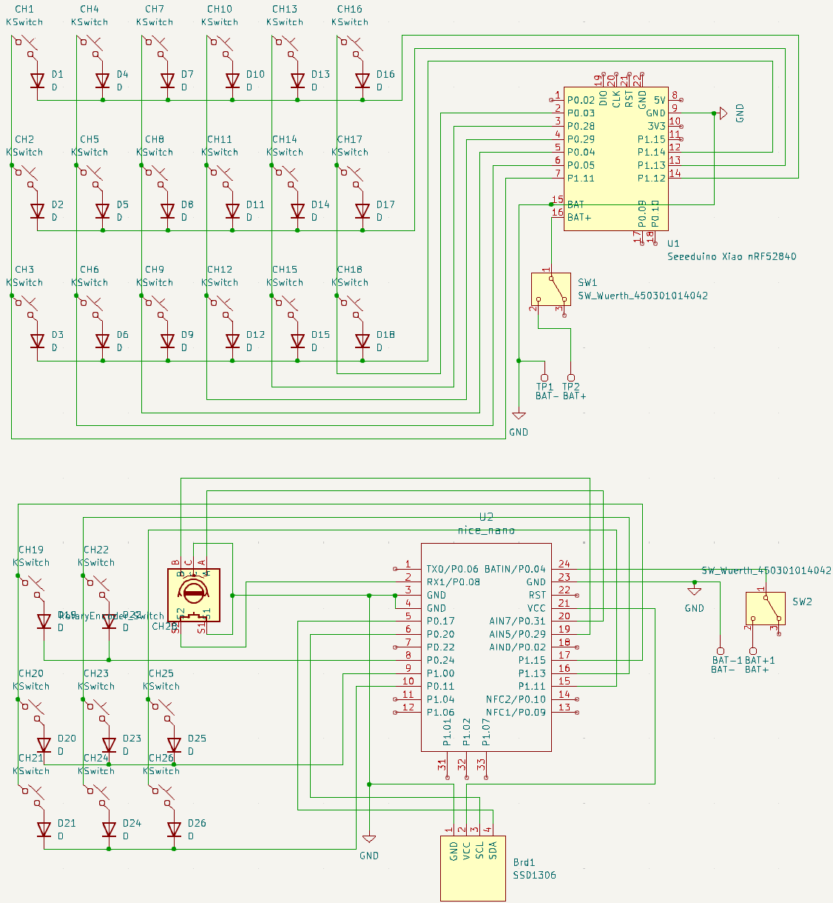
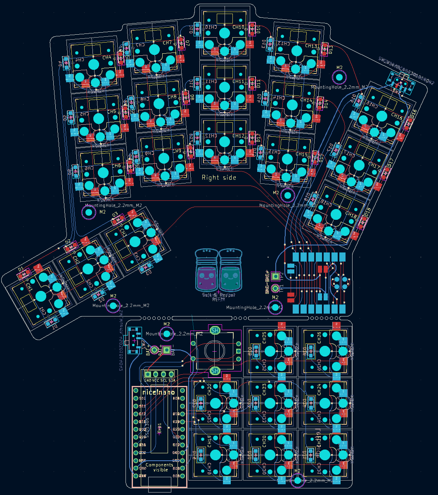

# Pipar PCBs

ZMK firmware for the Pipar PCBs.

All builds:

**Pipar** is a collection of different keyboards and keypads that I have designed. Each PCB in the series has unique features tailored to different needs and preferences.

## Designed PCBs

Seperated all the PCBs into their own folders for easier management.

~~Currently, both Pipar and Pipar Flake are designed to be manufactured together but used separately. Both PCBs are designed to be used with Choc v1 switches and hotswap sockets. The PCBs are built to be wireless.~~

### Pipar ja Sool (Pepper and Salt)

> [!NOTE]
> Pipar Miryoku builds can be found here: [[RasmusKoit/miryoku_zmk]](https://github.com/RasmusKoit/miryoku_zmk/actions/workflows/build-example-pipar.yml)
> 

The **Pipar ja Sool** is a 36-key split wireless keyboard with a 3x5+3 layout with a dongle. It features:

- **Microcontrollers**: XIAO BLE for both halves and a dongle.
- **Switches**: Ambients Silent Kailh Low Profile Nocturnal Choc Switches.
- **Sockets**: Kailh Hotswap sockets for easy switch replacement.
- **Key Layout**: Pipar uses Miryoku default key layout.

#### Pipar ja Sool Pictures

#### Pipar ja Sool Design Details

- **Layout**: Splayed split keyboard with a 3x5+3 layout.
  - **Thumb Cluster**: Three keys on each half.
  - **Outer Columns**: Split to reduce the distance to the keys.
- **Wireless**: Uses the XIAO BLE microcontroller for both halves and a dongle.
- **Battery**: Larger area for the battery to ensure longer usage time.

#### Pipar ja Sool Order List

- **PCB**: 2x Pipar PCBs.
- **Microcontroller**: 3x [XIAO BLE microcontrollers (Aliexpress)](https://www.aliexpress.com/item/1005004459618789.html?spm=a2g0o.order_list.order_list_main.20.2f8718028ReplC)
- **On/Off Switch**: 2x [On/Off Switch (Aliexpress)](https://www.aliexpress.com/item/1005006710234187.html?spm=a2g0o.order_list.order_list_main.15.2f8718028ReplC)
- **Thread inserts**: 36x [M2 Thread Inserts (Aliexpress)](https://www.aliexpress.com/item/1005003582355741.html?spm=a2g0o.order_list.order_list_main.10.2f8718028ReplC)
- **Screws**: 10x [M2x4mm Screws (Aliexpress)](https://www.aliexpress.com/item/1005005070119421.html?spm=a2g0o.order_list.order_list_main.5.2f8718028ReplC)
- **Switches**: 36x [Ambients Silent Kailh Low Profile Nocturnal Choc Switches (SplitKB)](https://splitkb.com/products/ambients-kailh-low-profile-choc-switches?variant=48116119830875)
- **Sockets**: 36x [Kailh Hotswap sockets (SplitKB)](https://splitkb.com/products/kailh-hotswap-sockets?variant=39472161456205)
- **Diodes**: 36x [1N4148/SOD-123 Diodes (SplitKB)](https://splitkb.com/products/smd-diodes?variant=42283984027907)
- **Battery**: 2x [320mAh 3x30x40mm (Oomipood)](https://www.oomipood.ee/product/accu_lp303040_cl). Case is designed for 3mm height batteries with some extra space.
- **Case**: 1x [Pipar Case](https://cad.onshape.com/documents/b447867a8ef38c5c4b3f03a8/w/fa3f83cbdca5dabb6eda5ba8/e/aa2f21b7f0fc9dfb83784403?renderMode=0&uiState=66ebfb933005041fa7950d33)
- **Keycaps**: 1x [Kailh Choc Keycaps (FKCaps)](https://fkcaps.com/custom/KYTMMA)

### Pipar Flake

The **Pipar Flake** is an 8+1 key wireless keypad with a rotary encoder and a screen. It includes:

- **Microcontroller**: SuperMini NRF52840.
- **Display**: Tiny OLED display.
- **Switches**: Ambients Silent Kailh Low Profile Nocturnal Choc Switches.
- **Sockets**: Kailh Hotswap sockets for easy switch replacement.

#### Pipar Flake Pictures

#### Pipar Flake Design Details

- **Usage**: Intended as a tiny keypad or numpad.
  - **Current Use Case**: Control media player (e.g., Kodi).
- **Size**: Designed to be as small as possible while still being usable.
- **Rotary Encoder**:  
  - **Function**: Can control volume.
  - **Push Button**: Can be used to change layers.

## Schematic

Here is the schematic for the Pipar PCBs:

## Layout

The layout of the Pipar PCBs is shown below:

## Render

A render of the Pipar PCB design:

