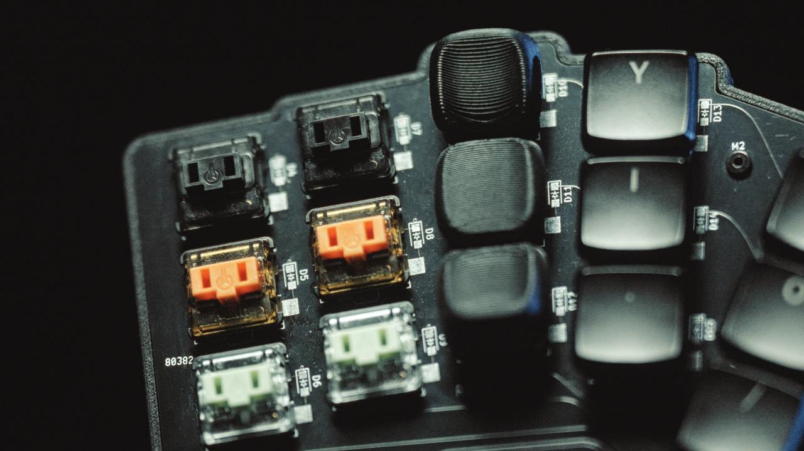
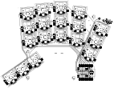
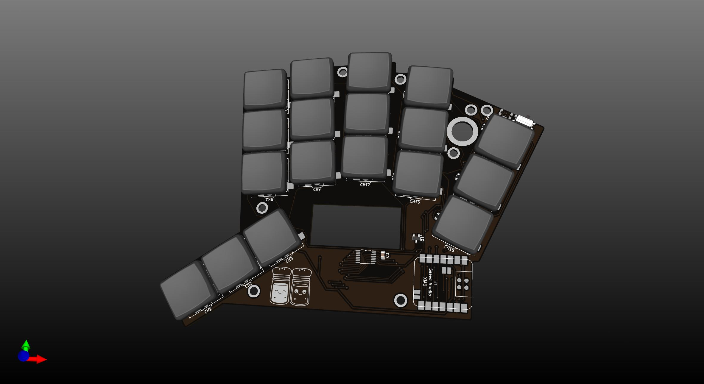
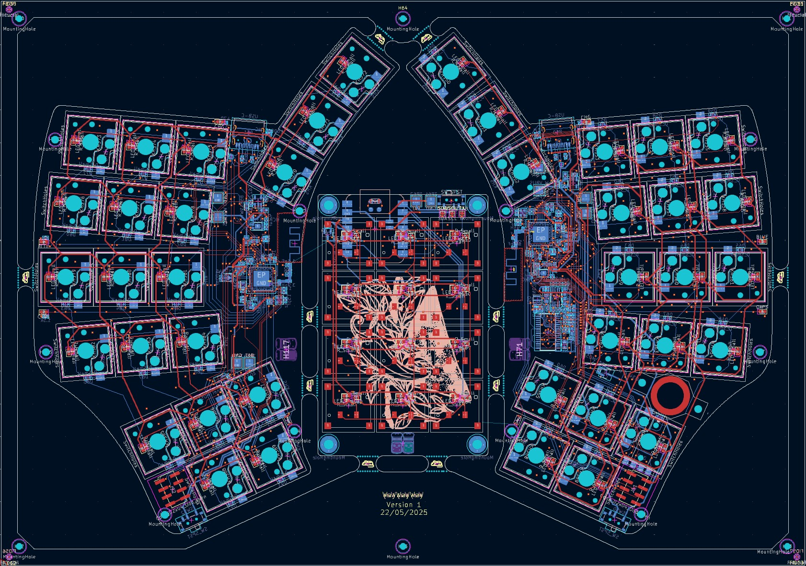
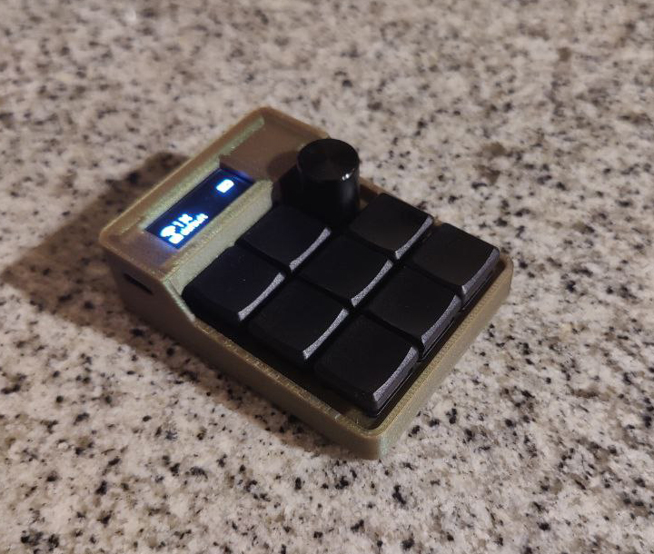

# Pipar PCBs

ZMK firmware for the Pipar PCBs.

**Pipar** is a collection of different keyboards and keypads that I have designed. Each PCB in the series has unique features tailored to different needs and preferences.

## Designed PCBs

PCB Files for each keyboard/project has been seperated into their own folders. The PCBs are designed in KiCad v8.0

Currently, the following PCBs are available:

- [Pipar & Sool](#pipar-ja-sool-pepper-and-salt) - 36-key split wireless keyboard with a 3x5+3 layout and a dongle.
- [Pipar Point](#pipar-point) - 36-key split wireless keyboard with a 3x5+3 layout, trackpoint, LEDs and a dongle.
- [Pipar Flake](#pipar-flake) - 8+1 key wireless keypad with a rotary encoder and a screen.

### Pipar ja Sool (Pepper and Salt)

> [!TIP] Get your own Pipar & Sool from my [Etsy Store](https://piparkeyboards.etsy.com).

Pipar Miryoku builds can be found here: [[RasmusKoit/miryoku_zmk]](https://github.com/RasmusKoit/miryoku_zmk/actions/workflows/build-example-pipar.yml)

The **Pipar ja Sool** is a 36-key split wireless keyboard with a 3x5+3 layout with a dongle. It features:

- **Microcontrollers**: XIAO BLE for both halves and a dongle.
- **Switches**: Ambients Silent Kailh Low Profile Nocturnal Choc Switches.
- **Sockets**: Kailh Hotswap sockets for easy switch replacement.
- **Key Layout**: Pipar uses Miryoku default key layout.

#### Pipar ja Sool Pictures

#### Pipar ja Sool Design Details

- **Layout**: Splayed split keyboard with a 3x5+3 layout.
  - **Thumb Cluster**: Three keys on each half.
  - **Outer Columns**: Split to reduce the distance to the keys.
- **Wireless**: Uses the XIAO BLE microcontroller for both halves and a dongle.
- **Battery**: Larger area for the battery to ensure longer usage time.

#### Pipar ja Sool Order List

- **PCB**: 2x Pipar PCBs.
- **Microcontroller**: 3x [XIAO BLE microcontrollers (Aliexpress)](https://www.aliexpress.com/item/1005004459618789.html?spm=a2g0o.order_list.order_list_main.20.2f8718028ReplC)
- **On/Off Switch**: 2x [On/Off Switch (Aliexpress)](https://www.aliexpress.com/item/1005006710234187.html?spm=a2g0o.order_list.order_list_main.15.2f8718028ReplC)
- **Thread inserts**: 36x [M2 Thread Inserts (Aliexpress)](https://www.aliexpress.com/item/1005003582355741.html?spm=a2g0o.order_list.order_list_main.10.2f8718028ReplC)
- **Screws**: 10x [M2x4mm Screws (Aliexpress)](https://www.aliexpress.com/item/1005005070119421.html?spm=a2g0o.order_list.order_list_main.5.2f8718028ReplC)
- **Switches**: 36x [Ambients Silent Kailh Low Profile Nocturnal Choc Switches (SplitKB)](https://splitkb.com/products/ambients-kailh-low-profile-choc-switches?variant=48116119830875)
- **Sockets**: 36x [Kailh Hotswap sockets (SplitKB)](https://splitkb.com/products/kailh-hotswap-sockets?variant=39472161456205)
- **Diodes**: 36x [1N4148/SOD-123 Diodes (SplitKB)](https://splitkb.com/products/smd-diodes?variant=42283984027907)
- **Battery**: 2x [320mAh 3x30x40mm (Oomipood)](https://www.oomipood.ee/product/accu_lp303040_cl). Case is designed for 3mm height batteries with some extra space.
- **Case**: 1x [Pipar Case](https://cad.onshape.com/documents/b447867a8ef38c5c4b3f03a8/w/fa3f83cbdca5dabb6eda5ba8/e/aa2f21b7f0fc9dfb83784403?renderMode=0&uiState=66ebfb933005041fa7950d33)
- **Keycaps**: 1x [Kailh Choc Keycaps **Colemak-DH** (FKCaps)](https://fkcaps.com/custom/KYTMMA)

### Pipar Point

> [!NOTE]
> I am happy to announce that for the Pipar Point project, I have partnered with [PCBWay](https://www.pcbway.com/) to provide the PCBs for the project. PCBWay is a professional PCB manufacturer with over 10 years of experience in the industry. They offer a wide range of services, including PCB manufacturing, PCB assembly, and PCB design. I am excited to be working with PCBWay on this project, and I am confident that they will deliver high-quality PCBs that meet my specifications.

*Currently in design phase.*

> [!TIP]
> Pipar Miryoku builds can be found here: [[RasmusKoit/miryoku_zmk]](https://github.com/RasmusKoit/miryoku_zmk/actions/workflows/build-example-pipar.yml)
> 

The **Pipar Point** is a 36-key split wireless keyboard with a 3x5+3 layout, trackpoint, LEDs and a dongle. It includes:

- **Microcontrollers**: XIAO BLE for both halves and a dongle.
- **Switches**: Ambients Silent Kailh Low Profile Nocturnal Choc Switches.
- **Sockets**: Kailh Hotswap v1/v2 sockets for easy switch replacement.
- **Trackpoint**: Lenovo T460S Trackpoint for mouse control on the right side.
- **LEDs**: White LEDs for visual feedback.
- **Components**: Uses smaller components in 0805/SOD-323 package for resistors, capacitors.
- **Top Plate**: Designed to be used with a top plate for a more rigid build.
- **Batteries**: Massive 2500mAh to compensate for the power draw of the trackpoint and LEDs.

#### Pipar Point Pictures

#### Pipar Point Design Details

- **Layout**: Splayed split keyboard with a 3x5+3 layout.
  - **Thumb Cluster**: Three keys on each half.
  - **Outer Columns**: Split to reduce the distance to the keys.
- **Wireless**: Uses the XIAO BLE microcontroller for both halves and a dongle.
- **Battery**: Larger area for the battery to ensure longer usage time.
- **Trackpoint**: Lenovo T460S Trackpoint for mouse control on the right side.
- **LEDs**: I sometimes miss the visual feedback of the LEDs, so I added them to the design.
- **Top Plate**: Designed to be used with a top plate for a more rigid build.

Idea was to iterate on the Pipar ja Sool design and add a trackpoint for mouse control. The design is still in the early stages and will be updated as the project progresses. Because of the trackpoint, LEDs and the battery size has been increased to 2500mAh to compensate for the power draw of the trackpoint and LEDs. With this design, I am aiming to challege myself to design a more complex PCB by using more components which will also be smaller in size. The design will also include a top plate to make the build more rigid, because the possibility of using choc v1/v2 switches. Instead of just holes for mounting with M2 screws, the design will include M2 solder nuts for mounting the PCB.

### Pipar Flake

The **Pipar Flake** is an 8+1 key wireless keypad with a rotary encoder and a screen. It includes:

- **Microcontroller**: SuperMini NRF52840.
- **Display**: Tiny OLED display.
- **Switches**: Ambients Silent Kailh Low Profile Nocturnal Choc Switches.
- **Sockets**: Kailh Hotswap sockets for easy switch replacement.

#### Pipar Flake Pictures

#### Pipar Flake Design Details

- **Usage**: Intended as a tiny keypad or numpad.
  - **Current Use Case**: Control media player (e.g., Kodi).
- **Size**: Designed to be as small as possible while still being usable.
- **Rotary Encoder**:  
  - **Function**: Can control volume.
  - **Push Button**: Can be used to change layers.
